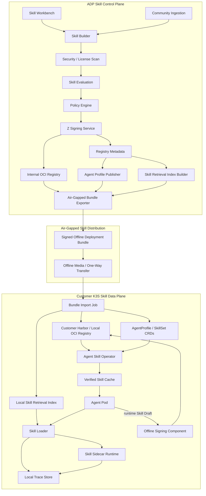
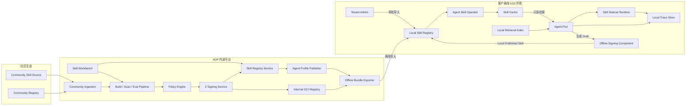
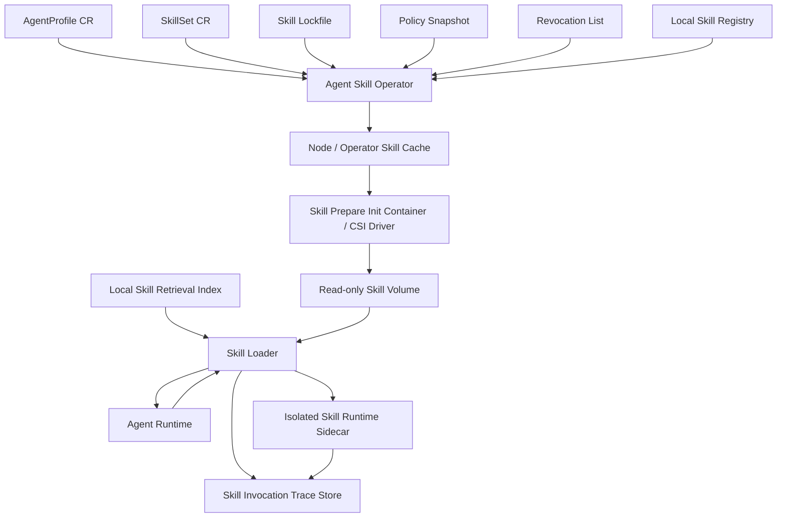
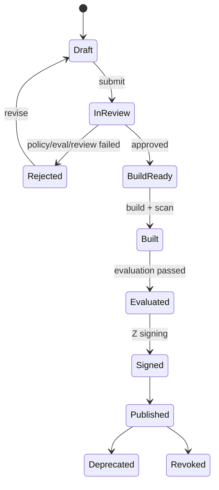
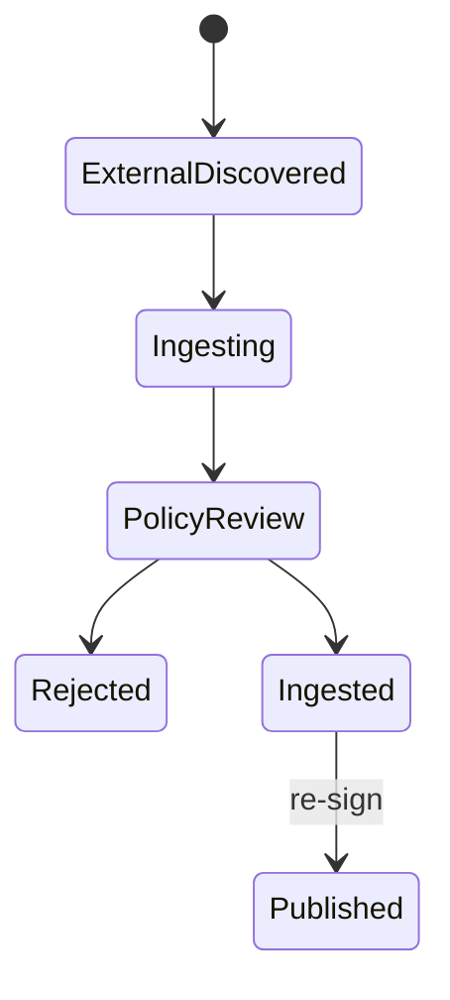
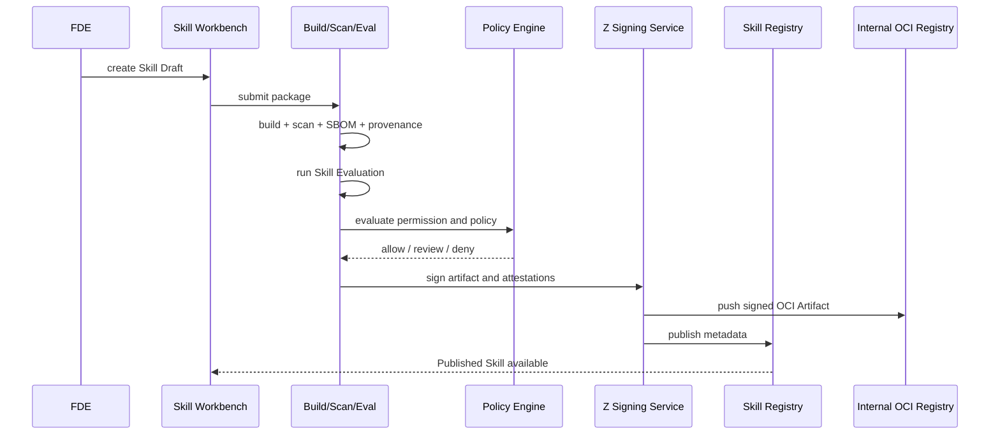
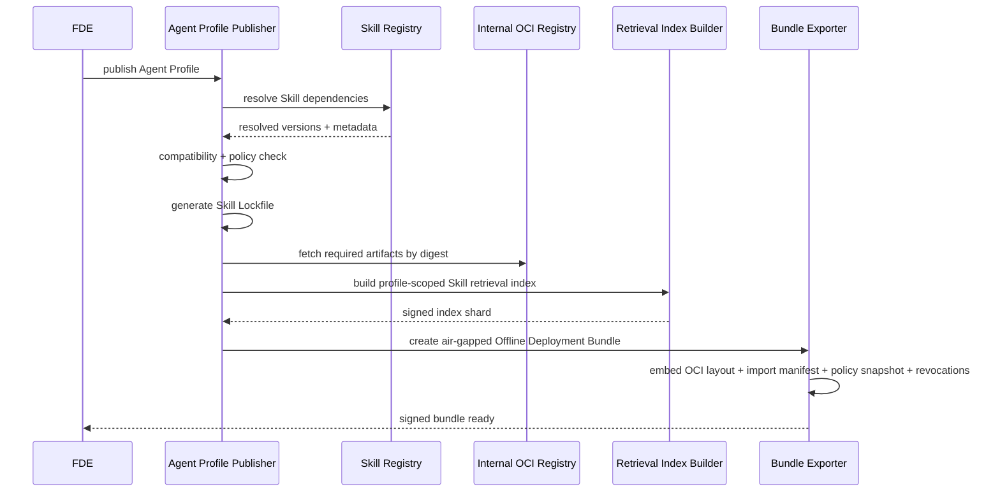
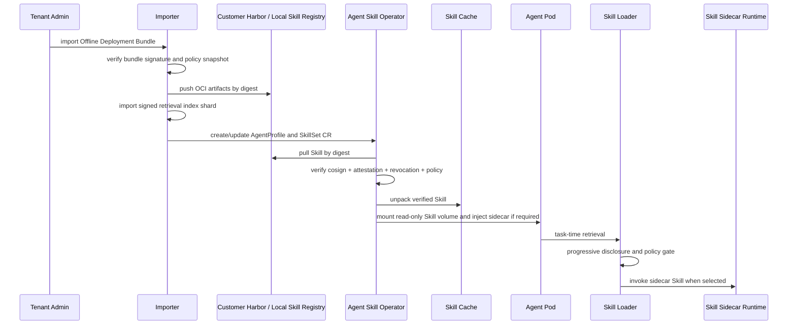
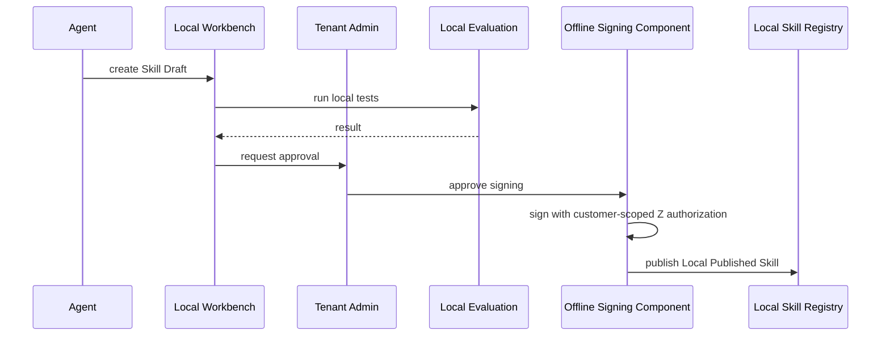

# Agent Skill Registry 技术设计文档


## 0. 交付摘要

本方案面向 Z 司内部 ADP 平台，为平台研发和 FDE 提供 Agent Skill Registry 能力。更准确地说，本方案把 Registry 作为入口，设计一套企业级 Agent Skill Infrastructure Platform：ADP 侧是 Skill Control Plane，负责 Skill 的发现、开发、摄取、评测、治理、签名、发布、依赖锁定和离线导出；客户离线 K3S 侧是 Skill Data Plane，负责离线导入、本地注册、Operator reconcile、Skill Cache、只读挂载、Sidecar Runtime、语义检索、热加载、追踪、撤销和本地受控发布。

MVP 不追求生产级外部依赖接入，而是验证受控供应链闭环：

- FDE 在 Workbench 创建 Skill Draft，声明 Runtime Payload、Permission Manifest 和 smoke Evaluation。
- Registry 对 Draft 做策略校验、评测门禁、SBOM/provenance 生成、签名和 Published Skill 元数据发布。
- ADP 摄取固定版本的 Community Skill，锁定来源、检查许可证/扫描结果，并重签为 Z 信任根下的 Published Skill。
- Agent Profile 发布时生成 Skill Lockfile，冻结 Skill 版本、digest、签名、SBOM/provenance 和权限摘要。
- Offline Deployment Bundle 携带 Lockfile、Policy Snapshot、Skill Artifact、签名和 Revocation List。
- 客户环境导入 Bundle 到 Local Skill Registry，生产形态由 Agent Skill Operator 根据 Lockfile 完成校验、缓存、只读挂载和 K8S 权限资源物化；MVP 以 `ControllerMountPlan` 模拟该行为。
- Agent Runtime 只加载本地已验签、未撤销、digest 匹配的 Skill，并记录 Skill Invocation Trace。
- 运行中 Agent 可以创建 Skill Draft，但 Draft 默认不可执行，必须经评测和本地发布成为 Local Published Skill。
- 客户安全人员可以离线导入 signed Revocation List，阻止被撤销 Skill 后续挂载和热加载。

当前仓库中的 MVP 实现为单进程 Go 服务，使用本地磁盘保存 OCI-like Artifact，用 HMAC 模拟签名，用确定性的 Controller Mount Plan 模拟 K3S Operator 行为。该实现用于验证要求的端到端供应链闭环；生产设计以 OCI Artifact、Harbor/Distribution、ORAS、Sigstore/cosign、OPA/Gatekeeper、Kubernetes CRD/Operator、Skill Sidecar Runtime 和 Semantic Skill Retrieval 为核心替换点。

## 1. 背景与目标

Z 司是一家专注强数据安全领域的 AI Agent 公司。内部 ADP 平台面向平台研发和 FDE，产出可部署到客户离线私有化 K3S 集群的 Agent Profile。Agent Profile 会声明对 Agent Skill 的依赖；客户环境中的 Agent Skill Operator 需要把这些 Skill 安全、可审计、可复现地挂载进 Agent Pod，并支持运行时热加载。

本设计的目标是为 ADP 提供 Agent Skill Infrastructure Platform，使 FDE 可以发现、复用、开发、评测、上架 Skill，同时使客户离线环境可以按锁定依赖、安全策略和本地信任链运行这些 Skill。Registry 不是终点，而是 Skill Control Plane 和 Skill Data Plane 之间的治理、分发和运行时契约。

核心目标：

- 为 FDE 提供低门槛但生产级的 Skill Workbench。
- 支持内部 Skill、社区 Skill 摄取、FDE 自建 Skill、Agent 运行时生成 Skill Draft。
- 建立完整的 Skill OS 式基础设施：源码输入、构建、扫描、评测、签名、锁定、离线导出、本地导入、Operator reconcile、Skill Cache、运行时挂载、语义检索、热加载、追踪、撤销。
- 复用社区关键生态：OCI Artifact、OCI Registry、ORAS、Sigstore/cosign、SBOM、SLSA provenance、OPA/Kubernetes admission、Kubernetes Operator/CRD、K3S air-gap 机制。
- 保证客户离线环境不直接信任社区 registry，不联网解析版本范围，不保存 ADP Secret，不绕过本地审批。

## 2. 关键结论

1. Skill 是一个可版本化、可签名、可分发的包，而不是单纯运行时能力目录。
2. ADP 采用“双轨输入、单轨发布”：FDE 或摄取流程可提交 Skill Package / Skill Draft，但 Registry 只分发经过构建、扫描、评测和签名的 Published Skill。
3. Published Skill 使用 OCI Artifact 承载，复用 OCI Registry、ORAS、镜像同步、摘要、签名和 SBOM 生态。
4. 社区 Skill 必须先被 ADP 摄取、锁定来源、扫描、审批并由 Z 公司重签名，客户环境永远不直接信任社区原始签名。
5. Agent Profile 发布时必须生成 Skill Lockfile，客户侧 Agent Skill Operator 只按 Lockfile 拉取和挂载，不在客户现场解析版本范围。
6. 客户环境必须部署 Local Skill Registry，Agent Skill Operator 只从 Local Registry 或 Skill Cache 读取 Skill。
7. Agent Skill Operator 预拉取、校验、缓存并只读挂载 Skill 到 Agent Pod；Agent 运行时可热加载，但只接受本地已挂载且验签通过的 Skill 版本。
8. 运行时 Agent 可创建 Skill Draft；Draft 不能直接执行，必须经过本地评测、Tenant Admin 审批和 Z 授权 Offline Signing Component 签名后成为 Local Published Skill。
9. Skill Workbench 是 MVP 核心能力，不是后续附加 UI。
10. Skill Registry 不只是包仓库，还必须内置评测、权限、策略、审计、撤销和运行时质量信号。
11. 客户 K3S 侧必须以 Agent Skill Operator 为生产形态，而不是让 Agent 应用自己拉取 Skill；Operator 承担 CRD watch、digest 验证、缓存、挂载、权限物化和状态上报。
12. 动态加载必须通过 Skill Loader 和 Skill Sidecar Runtime 明确建模；低风险 Skill 可 in-process，高风险或依赖复杂 Skill 走 sidecar/wasm/microVM。
13. Skill 数量增长后不能全量进入上下文；必须支持 Semantic Skill Retrieval 和 Progressive Skill Disclosure，只在任务相关时加载 Skill card、manifest、asset 和 payload。

## 3. 范围

### 3.1 MVP 范围

MVP 必须完成从 Skill 创建到客户离线运行的受控闭环。为了交付周期内证明关键设计，本设计把 MVP 分成“可运行验证版”和“生产替换点”两层：可运行验证版使用本地文件、HMAC 和模拟 Controller Mount Plan；生产替换点保持 API、schema 和领域模型稳定，后续替换为真实 OCI Registry、Sigstore/cosign、OPA 和 Kubernetes Agent Skill Operator。

MVP 可运行验证版包含：

- Skill Workbench 最小可用流：创建、模板、依赖选择、权限向导、沙箱测试、smoke evaluation、提交发布。
- Registry Service：Skill 元数据、版本、命名空间、可见性、状态流转、搜索。
- OCI-like Artifact 发布：manifest、runtime payload、assets、evaluation artifacts、SBOM、provenance、签名，本地磁盘保存。
- 社区 Skill 摄取最小链路：来源 URL、版本、digest 锁定，许可证检查，扫描结果输入，smoke evaluation，Z 公司重签名。
- Published Skill 不可变版本管理。
- Agent Profile 发布时生成 Skill Lockfile。
- Offline Deployment Bundle 导出与客户侧导入。
- 客户 Local Skill Registry 的本地模拟导入。
- Agent Skill Operator 模拟：Lockfile 校验、artifact digest 校验、验签、撤销检查、只读挂载计划、热加载就绪状态。
- Skill Permission Manifest 基础映射：Secret projection、NetworkPolicy、ServiceAccount/RBAC、volume、securityContext 的 Kubernetes-shaped resource plan。
- Skill Invocation Trace 本地记录。
- 离线 signed Revocation List 导出与导入。
- Agent Runtime 创建 Skill Draft，且 Draft 必须经 smoke evaluation 和本地发布才能成为 Local Published Skill。

MVP 暂不做：

- 复杂 marketplace 推荐、排行和个性化搜索。
- 客户现场 Skill 自动回流 ADP 全局复用。
- 所有隔离运行时后端一次性支持完备。
- 跨客户统计分析。
- 完整 AI 自动生成 Skill 的安全证明体系。
- 真实 OCI Registry push/pull、Sigstore/cosign 签名、OPA/Rego admission、K3S CRD/Agent Skill Operator reconcile。

### 3.2 非目标

- ADP 不面向终端用户开放。
- 客户环境不直接访问 ADP 在线服务。
- 客户环境不直接信任社区 registry、社区签名或浮动版本。
- Skill 包不携带客户 Secret 值。
- 大型知识库不直接嵌入 Skill 包。

## 4. 设计条件与假设

### 4.1 已知条件

- ADP 是公司内部 Agent 开发平台。
- FDE 技术背景可能偏弱，但有强领域知识并高度关注 Skill 效果。
- ADP 产物 Agent Profile 会部署到客户离线私有化环境，本质是 K3S 集群。
- Agent Profile 会声明 Skill 依赖。
- Agent 运行时需要支持动态加载 Skill。
- Agent 运行时可以自主创建新 Skill。
- 客户环境是强数据安全场景，默认不能依赖公网连接。

### 4.2 合理假设

- ADP 在线环境可访问内部 Git、CI、artifact registry、模型评测服务、安全扫描服务。
- 客户环境允许导入离线部署包，但默认不能访问公网或 ADP。
- 客户环境 K3S 允许安装 CRD、Agent Skill Operator、Local Registry、NetworkPolicy provider、metrics/logging 组件。
- Z 公司可以维护企业签名根，并为客户环境发放受限 Offline Signing Component。
- 客户环境存在 Tenant Admin 角色负责本地导入和审批。
- FDE 可使用 Workbench 作为主路径，高级用户可使用 CLI/SDK/GitOps。

## 5. 术语

本设计沿用 [CONTEXT.md](../CONTEXT.md) 中的领域语言。关键术语如下：

- Skill：可版本化、可签名的包，包含 metadata、依赖和可执行 payload。
- Skill Draft：FDE 或运行时 Agent 创建的未信任候选 Skill。
- Published Skill：经过构建、扫描、评测、签名后的不可变 Skill 版本。
- Local Published Skill：客户环境内生成、签名且仅在该客户环境有效的 Published Skill。
- Ingested Skill：社区 Skill 被 ADP 摄取、锁源、检查、重签名前后的受控状态。
- Skill Lockfile：冻结所有直接和传递依赖版本、digest、签名链、SBOM 引用的清单。
- Skill Permission Manifest：声明 Skill 需要的数据、网络、文件、Secret、模型、工具和 K8S 权限。
- Skill Workbench：FDE 创建、测试、评测、提交 Skill 的 ADP 工作台。
- Local Skill Registry：客户环境内存放可信 Skill Artifact 的 Registry。
- Offline Deployment Bundle：ADP 面向客户导出的离线部署包。
- Offline Signing Component：Z 授权、客户环境内可用、作用域受限的离线签名组件。
- Skill Invocation Trace：客户本地记录的 Skill 调用追踪。

## 6. 功能性需求拆解

### 6.1 ADP 平台侧

- Skill 目录：支持按 namespace、领域、标签、版本、质量、权限、运行时模式搜索和过滤 Skill。
- Semantic Skill Retrieval：为每个 Published Skill 生成 Skill card、embedding、schema 摘要、权限摘要、质量摘要和 trust level，用于 Agent 任务时检索。
- Skill 创建：支持 FDE 通过 Workbench 从模板、已有 Internal Skill、已摄取 Community Skill 创建 Skill Draft。
- Skill 摄取：支持社区 Skill 来源锁定、SBOM、许可证检查、安全扫描、审批和 Z 公司重签名。
- Skill 发布：支持构建、扫描、评测、策略校验、签名、OCI Artifact 推送和元数据发布。
- Skill 评测：支持 smoke evaluation、领域数据集、人工 rubric、LLM judge、回归基线和失败案例记录。
- 依赖解析：支持直接依赖和传递依赖解析，生成不可漂移的 Skill Lockfile。
- Agent Profile 发布：支持兼容性检查、权限汇总、Policy Snapshot 绑定和 Offline Deployment Bundle 导出。
- 治理审计：支持审批、拒绝、废弃、撤销、签名、导出等操作的审计记录。

MVP 可运行验证版在 ADP 侧先实现以下收敛能力：

- Published Skill 搜索按 namespace、文本 query、visibility、source、runtime mode 过滤。
- Community Skill 摄取接受已锁定的 source URL、version、digest、license 和 scan 结果，禁止 failed scan、unknown/unlicensed license 和未通过 smoke evaluation 的 Skill 进入发布态。
- 签名使用本地 HMAC 模拟 Z Signing Service，签名 scope 区分 `z-global` 与 `customer-local`。
- Offline Bundle 与 Revocation List 都带签名，导入时校验签名与 artifact digest。
- 所有关键动作写入 AuditEvent，包括 draft.create、draft.evaluate、skill.publish、community.ingest、agent_profile.resolve、offline_bundle.export/import、revocation_list.export/import。

### 6.2 客户环境侧

- 离线导入：支持导入 Offline Deployment Bundle，并校验 bundle 签名、artifact digest、Policy Snapshot、Revocation List。
- 本地 Registry：支持存放 ADP 导入的 Published Skill 和客户本地生成的 Local Published Skill。
- Workload 调谐：Agent Skill Operator 根据 AgentProfile CR、SkillSet CR 和 Skill Lockfile 拉取、校验、缓存、挂载 Skill。
- Skill Cache：支持节点级或集群级 verified cache，避免每个 Pod 重复拉取和解包 artifact。
- 权限落地：Agent Skill Operator 将 Skill Permission Manifest 转译为 NetworkPolicy、RBAC、Secret projection、volume、securityContext 等约束。
- Runtime Injection：Operator 或 CSI Driver 将 Skill 以只读卷注入 Agent Pod，并按风险等级选择 in-process、sidecar、wasm 或 microVM。
- 热加载：Agent Runtime 仅热加载本地已挂载、验签通过、未撤销且兼容的 Skill 版本，切换采用 two-phase load。
- Semantic Skill Retrieval：客户侧使用随 Bundle 导入的本地检索索引，运行时按任务 TopK 选择 Skill，避免全量上下文加载。
- 本地创建：运行中 Agent 可创建 Skill Draft；Draft 经本地评测、Tenant Admin 审批、Offline Signing Component 签名后成为 Local Published Skill。
- 离线撤销：支持导入 Revocation List 或 emergency revocation bundle，阻止被撤销 Skill 新准入和热加载。
- 本地观测：客户环境记录 Skill Invocation Trace，并只在客户授权后导出脱敏诊断包。

MVP 可运行验证版在客户侧先实现以下收敛能力：

- Local Skill Registry 用服务本地 state 和 artifacts 目录模拟，导入 Bundle 后可按 digest 读取 Artifact。
- Controller 不创建真实 K8S 对象，而是输出 `ControllerMountPlan`，其中包含 read-only mount path、hot-load ready 标记和 Kubernetes-shaped permission resources。
- Runtime invoke 会执行 signature、revocation、digest 所属 Published Skill 检查，然后调用 template/echo payload 并生成 Skill Invocation Trace。
- Runtime Draft API 只允许具备 `draft_creation.allowed=true` 的请求创建 Draft，服务会把创建者强制标记为 `agent-runtime`，并清除 Draft 继续创建 Draft 的权限。
- Runtime-created Draft 不能直接执行或挂载，必须先通过 evaluation，再以 `local=true` 发布为 Local Published Skill。

### 6.3 FDE 工作流

- 以 Workbench 作为主路径完成创建、测试、评测、提交和复用。
- 可视化查看 Skill 的依赖、权限、质量、适用范围和已知限制。
- 可在沙箱中用样例数据和 mock Secret 运行 Skill。
- 可基于社区摄取后的 Published Skill 二次开发，但不能直接依赖未摄取社区来源。
- 可看到发布失败原因，包括策略拒绝、评测失败、扫描失败和兼容性失败。

## 7. User Stories

### 7.1 FDE 发现并复用已有 Skill

作为 FDE，我希望在 Skill Workbench 中按领域、权限、质量评分、适用场景搜索内部 Skill 和已摄取社区 Skill，从而快速为 Agent Profile 添加可靠依赖。

验收标准：

- 可以按 namespace、标签、输入输出 schema、权限、运行时模式、质量分过滤。
- 只能选择对当前项目可见且策略允许的 Skill。
- 选择后 ADP 能预览依赖树、权限增量、兼容性、评测摘要和已知限制。
- Agent Profile 发布时生成锁定依赖的 Skill Lockfile。

### 7.2 FDE 基于模板创建 Skill

作为 FDE，我希望通过模板和向导创建 Skill，而不是手写完整 manifest，从而把主要精力放在领域逻辑和效果评测上。

验收标准：

- Workbench 提供任务型模板，例如数据查询、流程编排、文档分析、外部系统操作、评估器。
- 向导生成 Skill Manifest、Permission Manifest、默认 Evaluation Artifacts。
- 可以在沙箱中用样例输入运行并查看输出、trace、错误和权限提示。
- 提交发布前必须通过 smoke evaluation。

### 7.3 FDE 基于社区 Skill 二次开发

作为 FDE，我希望基于社区 Skill 开发内部 Skill，从而复用社区生态，但不破坏 Z 公司的安全边界。

验收标准：

- 社区 Skill 不能直接进入客户环境或直接被 Agent Profile 依赖。
- ADP 摄取后记录来源、版本、digest、许可证、SBOM、扫描结果。
- 摄取完成后由 Z 公司重签名并形成 Published Skill。
- FDE 基于该 Published Skill 派生 Skill Draft，并保留 provenance。

### 7.4 平台安全人员审批 Skill 发布

作为平台安全人员，我希望在发布前看到权限、依赖、SBOM、provenance、评测、扫描和风险等级，从而决定是否允许发布。

验收标准：

- 发布审批页面展示权限 diff、传递依赖、许可证、漏洞、敏感 API、网络出口、Secret Reference。
- 策略引擎给出 allow / deny / needs-review 结果和原因。
- 审批结果、审批人、时间、策略版本写入审计记录。
- 只有通过审批的 Skill Draft 才能进入签名和发布。

### 7.5 ADP 发布 Agent Profile

作为平台发布系统，我希望在 Agent Profile 发布时冻结所有 Skill 依赖，从而使客户离线部署可复现。

验收标准：

- ADP 解析直接和传递依赖，选择确定版本。
- 生成 Skill Lockfile，包含 skill id、version、digest、signature chain、SBOM reference、provenance reference、runtime API、permission schema。
- 不允许 floating latest 进入 Lockfile。
- 兼容性检查失败则阻止发布。

### 7.6 客户 Tenant Admin 导入离线部署包

作为 Tenant Admin，我希望导入 Offline Deployment Bundle 后，本地 Registry 和 Agent Skill Operator 能校验并准备运行所需 Skill。

验收标准：

- 导入流程校验 bundle 签名、Policy Snapshot、Revocation List、Lockfile 和 artifact digest。
- 所有 Skill Artifact 被导入 Local Skill Registry。
- 导入结果有审计记录，失败项可定位。
- Agent Skill Operator 后续只从 Local Skill Registry 或 Skill Cache 读取。

### 7.7 Agent Skill Operator 挂载 Skill

作为 Agent Skill Operator，我希望按 Agent Profile 的 Skill Lockfile 将 Skill 安全挂载进 Agent Pod。

验收标准：

- Operator 不解析版本范围。
- 拉取前检查 Revocation List、签名、digest、Policy Snapshot。
- Skill 以只读卷挂载到标准路径。
- Secret 值只在客户环境按 Secret Reference 投影。
- 权限声明被转译成 K8S 运行约束。
- Operator 在 status condition 中暴露 SkillsResolved、ArtifactsVerified、SkillsMounted、RuntimeReady。

### 7.8 Agent 运行时热加载 Skill

作为 Agent Runtime，我希望在不重启 Pod 的情况下加载已挂载的新 Skill 版本。

验收标准：

- 只加载本地已挂载、digest 匹配、签名校验通过、未撤销的 Skill。
- 热加载前校验 Compatibility Contract。
- 加载失败不能影响当前已加载稳定版本。
- 热加载事件产生 Skill Invocation Trace 或 runtime event。

### 7.9 Agent 运行时创建 Skill Draft

作为运行中的 Agent，我希望在客户环境内基于任务经验生成 Skill Draft，从而让客户持续沉淀自动化能力。

验收标准：

- Agent 只能创建 Skill Draft，不能直接创建可部署 Skill。
- Draft 默认不进入执行路径。
- 本地 Workbench 或审批界面可查看、测试、评测该 Draft。
- Tenant Admin 审批后，由 Offline Signing Component 生成 Local Published Skill。
- Local Published Skill 只在该客户环境和 namespace 内有效。

### 7.10 客户安全人员撤销 Skill

作为客户安全人员，我希望在发现漏洞或效果事故时离线撤销某个 Skill 版本。

验收标准：

- 可导入 signed Revocation List 或 emergency revocation bundle。
- Agent Skill Operator 和 Skill Loader 在准入和热加载时拒绝被撤销版本。
- 可触发使用该版本的 Agent Pod 滚动重启、降级或停用。
- 撤销行为有本地审计记录。

### 7.11 Agent 按任务语义检索 Skill

作为 Agent Runtime，我希望只看到与当前任务相关的 Skill，而不是把所有可用 Skill 放进上下文，从而控制上下文预算并降低误用高风险 Skill 的概率。

验收标准：

- Local Skill Retrieval Index 随 Offline Deployment Bundle 导入客户环境，不依赖公网或 ADP 在线服务。
- Skill card 包含名称、领域、输入输出 schema 摘要、权限摘要、trust level、评测摘要和版本 digest。
- Skill Loader 先检索 TopK Skill card，再按需加载完整 manifest、examples、assets 和 Runtime Payload。
- 高风险 Skill 即使被检索命中，也需要满足权限、trust level 和 AgentProfile allowlist 后才能调用。

### 7.12 Skill Sidecar Runtime 执行高风险 Skill

作为平台安全人员，我希望高风险或依赖复杂的 Skill 不在 Agent 主进程内执行，从而降低恶意 Skill 或依赖冲突对 Agent 的影响。

验收标准：

- Skill Runtime Mode 可声明 `sidecar`、`wasm` 或 `microvm`。
- Sidecar 只接受 Operator 已挂载且 Skill Loader 已选择的 Runtime Payload。
- Sidecar 使用统一 Skill Runtime Interface 暴露 Describe、Invoke、Health。
- Sidecar 的资源限制、seccomp/AppArmor、NetworkPolicy 和 trace emission 可被审计。

### 7.13 MVP 验收矩阵

| 要求 | MVP 验收方式 | 当前实现形态 |
| --- | --- | --- |
| FDE 引用已有内部 Skill | `/api/skills` 搜索 Published Skill，Agent Profile resolve 冻结依赖 | 已实现 |
| FDE 引用社区 Skill | `/api/community/ingestions` 摄取固定社区来源并重签 | 已实现，外部 registry pull 模拟 |
| FDE 开发并上架内部 Skill | `/api/drafts` 创建、`/evaluate` 评测、`/publish` 发布 | 已实现 |
| 基于社区 Skill 二次开发 | 摄取后形成 Published Skill，FDE 可把它作为依赖或派生 Draft 来源 | 已实现核心路径 |
| Agent Profile 声明 Skill 依赖 | `/api/agent-profiles/resolve` 生成 Skill Lockfile | 已实现 |
| 客户环境离线导入 | `/api/offline-bundles/export` 和 `/api/offline-bundles/import` | 已实现，本地 registry 模拟 |
| Controller 挂载 Skill 到 Agent Pod | `/api/controller/mount` 输出只读 mount plan 和权限资源映射 | 已实现，真实 K3S 对象 deferred |
| Agent 运行时动态加载 Skill | `/api/runtime/invoke` 验签、查撤销、执行 payload、记录 trace | 已实现 MVP payload |
| Agent 运行时自主创建 Skill | `/api/runtime/drafts` 创建受限 Draft | 已实现，仍需评测和 local publish |
| 客户离线撤销 | `/api/revocations/export` 与 `/api/revocations/import` | 已实现 |

## 8. 总体架构

### 8.0 架构定位：从 Registry 到 Skill OS

本设计把 Agent Skill Registry 拆成两个平面：

- Skill Control Plane：运行在 ADP 内部，负责 Skill 的治理生命周期。它包含 Workbench、Community Ingestion、Build/Scan/Eval、Policy Engine、Signing、Registry metadata、Internal OCI Registry、Agent Profile Publisher 和 Offline Bundle Exporter。
- Skill Data Plane：运行在客户离线 K3S 内，负责 Skill 的可信运行生命周期。它包含 Bundle Importer、Local Skill Registry、Agent Skill Operator、Skill Cache、Skill Sidecar Runtime、Skill Loader、Local Trace Store、Offline Signing Component 和 Revocation List。

Registry 只保存和索引 Published Skill 元数据；真正的企业级能力来自：

- OCI Artifact 作为 Skill 分发单元。
- Agent Skill Operator 作为 Kubernetes Runtime Injection 入口。
- Skill Runtime Interface 作为多语言和多隔离模式的调用契约。
- Skill Permission Manifest 和 Policy Snapshot 作为治理与运行时约束桥梁。
- Semantic Skill Retrieval 和 Progressive Skill Disclosure 作为规模化上下文控制机制。



### 8.1 ADP 与客户环境总体架构



### 8.2 客户侧运行时架构



运行时路径必须满足三个约束：

- Admission-time：Agent Skill Operator 在 Pod 运行前验证 Lockfile、签名、Revocation List、Policy Snapshot 和 digest，失败时通过 CR status 和 Kubernetes event 暴露原因。
- Mount-time：Operator 或 CSI Driver 把已验证 Skill 从 Skill Cache 以只读卷挂载到 Agent Pod，Secret 只通过客户环境 Secret projection 进入，不写入 Skill artifact。
- Task-time：Skill Loader 不全量加载 Skill，而是先从 Local Skill Retrieval Index 获取 TopK Skill card，再按需加载 manifest、assets 和 Runtime Payload，并通过 in-process 或 Skill Sidecar Runtime 调用。

## 9. 组件设计

### 9.1 Skill Workbench

定位：FDE 的主入口，MVP 核心。

能力：

- Skill 创建向导：选择模板、命名空间、输入输出 schema、runtime mode、依赖。
- Permission Manifest 向导：数据域、网络出口、文件系统、Secret Reference、模型调用、工具调用、K8S API。
- 依赖选择：展示版本、质量、权限增量、传递依赖、兼容性。
- 沙箱运行：使用 mock Secret、测试数据、受限网络和临时 workspace。
- Skill Evaluation：smoke tests、领域测试集、人工 rubric、LLM judge、回归对比。
- 发布检查清单：manifest 完整性、策略结果、扫描结果、SBOM、provenance、签名状态。
- Draft 管理：FDE Draft、Agent 生成 Draft、本地客户 Draft。

FDE 体验原则：

- 主路径不要求手写 YAML。
- 所有高风险权限必须用可解释语言展示。
- 评测结果要比构建日志更突出。
- 允许高级用户导入 Git repo 或使用 CLI，但 Workbench 仍是权威发布视图。

### 9.2 Skill Registry Service

职责：

- 管理 Skill Namespace、Skill ID、版本、可见性、状态流转。
- 存储 Published Skill 元数据、评测摘要、权限摘要、兼容性、SBOM/provenance 引用。
- 对接 Internal OCI Registry，不直接存放大 artifact blob。
- 支持搜索、依赖解析、版本策略、废弃标记、撤销标记。
- 为 Agent Profile Publisher 提供依赖解析 API。

状态机：



Community Skill 状态：



### 9.3 Build / Scan / Eval Pipeline

输入：

- Skill Package
- Skill Draft
- Ingested Skill source

输出：

- OCI Artifact
- Skill Manifest
- Skill Permission Manifest
- CycloneDX or SPDX SBOM
- SLSA-style provenance
- Evaluation result
- Signed artifact and signed attestations

流水线步骤：

1. Normalize：转换为标准 Skill Package 结构。
2. Dependency fetch：只从可信源或已摄取源获取依赖。
3. Static scan：恶意代码、敏感 API、硬编码 Secret、许可证、漏洞。
4. Build：生成 runtime payload 和 assets。
5. SBOM：生成 CycloneDX 或 SPDX。
6. Provenance：生成构建环境、源码、材料、builder 身份、参数记录。
7. Evaluation：运行 smoke evaluation 和配置的领域评测。
8. Policy check：OPA/Rego 或 Cedar 策略评估。
9. Signing：Z Signing Service 签名 artifact、SBOM、provenance、evaluation summary。
10. Publish：写 Registry metadata，推 OCI Artifact。

### 9.4 Community Ingestion

社区 Skill 是外部输入，不是可信 artifact。

摄取要求：

- 锁定来源 URL、commit/tag/version、digest。
- 记录原始作者、许可证、原始签名。
- 生成或导入 SBOM。
- 执行许可证策略和安全扫描。
- 禁止未摄取社区 Skill 被 Agent Profile 或 Local Published Skill 直接依赖。
- 通过审批后由 Z 公司重签名，成为 Z 信任域内的 Published Skill。

MVP 可运行验证版：

- 摄取请求显式携带 source URL、source version、source digest、license 和 scan result。
- 服务拒绝 `unknown` / `unlicensed` 许可证、failed scan、critical vulnerability 和未通过 smoke evaluation 的社区 Skill。
- 摄取通过后直接生成 Draft、运行 smoke evaluation、生成 SBOM/provenance、用 `z-global` scope 重签并发布。
- FDE 后续可以把该 Published Skill 作为 Agent Profile 依赖，也可以基于该 Published Skill 派生新的内部 Skill Draft。

### 9.5 Agent Profile Publisher

职责：

- 解析 Agent Profile 声明的 Skill version range。
- 检查 namespace 可见性和项目策略。
- 解析传递依赖。
- 检查 Compatibility Contract。
- 计算权限合并结果和冲突。
- 生成 Skill Lockfile。
- 将 Agent Profile、Lockfile、Policy Snapshot 和 artifact 列表交给 Offline Bundle Exporter。

重要规则：

- Lockfile 里只能出现确定版本和 digest。
- 禁止 latest、floating tag、未签名 artifact。
- 客户侧不重新解析版本范围。
- 版本不可变，废弃不等于删除。

### 9.6 Offline Bundle Exporter

Offline Deployment Bundle 内容：

- Agent Profile
- Skill Lockfile
- 全部 Published Skill OCI Artifact
- artifact signature bundle
- SBOM references or embedded SBOM files
- provenance attestations
- Policy Snapshot
- Revocation List baseline
- Local Registry import manifest
- install/upgrade plan

格式建议：

- 外层：tar.zst 或 OCI image layout。
- 内层：保持 OCI artifact 原始 digest 和 manifest。
- Bundle 本身也签名。
- 支持 chunk 和 resume，适应大客户离线介质导入。

### 9.7 Local Skill Registry

部署在客户 K3S 环境内。可选实现：

- MVP 可运行验证版：服务本地 state 和 artifact 目录模拟 Local Skill Registry。
- 生产 MVP：Harbor 或 CNCF distribution registry，加上平台自研 metadata adapter。
- 轻量场景：嵌入式 OCI registry + SQLite metadata。
- 严格安全场景：Harbor + 私有 CA + 离线漏洞库 + 审计。

职责：

- 存放 Offline Deployment Bundle 导入的 Published Skill。
- 存放客户环境生成的 Local Published Skill。
- 不允许直接 pull 社区 registry。
- 保留 namespace、digest、签名、SBOM、provenance 和撤销状态。

### 9.8 Agent Skill Operator

Agent Skill Operator 是客户 K3S 环境中的生产级 Runtime Injection 入口。它负责把 Agent Profile reconciled 成运行中 workload，并把 Skill Lockfile 中的 Published Skill 转换为本地已验证、可挂载、可热加载的运行时资源。Agent 应用不直接 pull registry，也不自行解析依赖。

职责：

- Watch AgentProfile CR。
- Watch SkillSet、PolicySnapshot、RevocationList 和 LocalPublishedSkill CR。
- 读取 Skill Lockfile。
- 从 Local Skill Registry 拉取 artifact。
- 校验 digest、签名、签名链、Policy Snapshot、Revocation List。
- 将验证后的 artifact 解包到 Skill Cache。
- 物化 Skill 到节点或 Pod 可见的只读目录，或通过 Skill CSI Driver 暴露。
- 注入 volume、env、Secret projection、ServiceAccount、NetworkPolicy、securityContext、sidecar container。
- 根据 Skill Trust Level 和 Runtime Mode 决定 in-process、sidecar、wasm 或 microVM 执行边界。
- 热加载时通知 Agent Runtime 或更新挂载目录版本指针。
- 维护 status condition 和 event。

Reconcile Loop：

1. 读取 AgentProfile spec 中的 profileRef、skillLockfileRef、policySnapshotRef。
2. 校验 Lockfile digest、Policy Snapshot 版本和 Agent Skill Operator 兼容矩阵。
3. 对每个 LockedSkill 从 Local Skill Registry 按 digest 拉取 OCI Artifact。
4. 校验 cosign signature、in-toto attestation、SBOM digest、Revocation List。
5. 评估 Skill Permission Manifest 与客户 namespace policy。
6. 将 artifact 解包到 Skill Cache，并生成 verification metadata。
7. 创建或更新 SkillSet status，记录 verified revision。
8. Patch Agent workload 的 volumes、init container 或 CSI volume、sidecar、NetworkPolicy、ServiceAccount/RBAC 和 securityContext。
9. 通知 Skill Loader 可用 revision；热加载失败时保留旧 revision。

建议 CRD：

```yaml
apiVersion: adp.z.ai/v1alpha1
kind: AgentProfile
metadata:
  name: invoice-agent
  namespace: tenant-a
spec:
  profileRef:
    name: invoice-agent
    version: 1.4.2
    digest: sha256:...
  skillLockfileRef:
    name: invoice-agent-1-4-2-lock
  policySnapshotRef:
    name: policy-2026-05-09
  skillRetrievalIndexRef:
    name: invoice-agent-skill-index
  runtime:
    hotReload: true
    sidecarRuntime: enabled
status:
  conditions:
    - type: SkillsResolved
      status: "True"
    - type: ArtifactsVerified
      status: "True"
    - type: SkillsMounted
      status: "True"
    - type: RuntimeReady
      status: "True"
    - type: Ready
      status: "True"
```

```yaml
apiVersion: adp.z.ai/v1alpha1
kind: SkillSet
metadata:
  name: invoice-agent-skills
  namespace: tenant-a
spec:
  lockfileDigest: sha256:...
  skills:
    - id: finance/invoice-extractor
      version: 2.1.0
      digest: sha256:...
      runtimeMode: in_process
      mountPath: /var/lib/adp/skills/finance.invoice-extractor/2.1.0
      trustLevel: internal
status:
  verified: true
  mountedRevision: "7"
```

MVP 可运行验证版输出 `ControllerMountPlan`，不直接操作 K3S API。该计划包含：

- Agent Profile identity 和 Policy Snapshot。
- 每个 Skill 的 id、version、digest、runtime interface、runtime mode。
- 标准只读挂载路径，如 `/var/lib/adp/skills/{namespace}/{name}/{version}`。
- `hot_load_ready`，表示该 Skill 已通过本地验签、撤销和 digest 校验。
- Permission resources：Secret projections、NetworkPolicy resources、ServiceAccount、RBAC rules、volumes、securityContext。

### 9.9 Semantic Skill Retrieval

Skill 数量增长后，Agent 不能把所有 Skill manifest、examples、assets 和工具说明一次性放入上下文。Semantic Skill Retrieval 是 Control Plane 和 Data Plane 共同维护的检索能力。

ADP 侧索引构建：

- 输入：Skill Manifest、输入输出 schema、description、examples、Evaluation summary、Permission Manifest、Trust Level、Compatibility Contract。
- 输出：Skill card、embedding、keyword index、permission summary、risk summary、version/digest anchor。
- 导出：Offline Deployment Bundle 携带与 Agent Profile 可见范围一致的 retrieval index shard。

客户侧运行时检索：

1. Agent 生成 task intent、domain hints、输入输出期望和权限上下文。
2. Skill Loader 查询 Local Skill Retrieval Index，得到 TopK Skill card。
3. Policy gate 过滤不可见、trust level 不足、权限超出 AgentProfile allowlist 或已撤销 Skill。
4. Agent 只看到 compact card 和必要 schema。
5. Agent 选择候选 Skill 后，Skill Loader 再加载完整 manifest、examples、assets。
6. 真正调用前才加载 Runtime Payload 或建立 sidecar/wasm session。

Progressive Skill Disclosure 分层：

- Card：几十到几百 token，适合进入 Agent 规划上下文。
- Manifest summary：输入输出、限制、权限和失败模式。
- Assets：examples、prompt、small references，只有候选 Skill 加载。
- Runtime Payload：只有调用时加载，不进入 LLM 长上下文。

安全约束：

- 检索命中不等于可调用；调用仍需经过签名、撤销、权限、trust level 和 compatibility 校验。
- Agent Generated 和 Unreviewed Community Skill 默认不能自动出现在 TopK，除非 AgentProfile 明确允许。
- Retrieval index 自身也签名并随 Bundle 导入，避免客户环境被投毒。

### 9.10 Agent Runtime and Skill Loader

Agent Runtime 必须实现 Skill Loader：

- 读取标准挂载路径，例如 `/var/lib/adp/skills/current/manifest.json`。
- 校验本地 verification metadata。
- 查询 Local Skill Retrieval Index 并执行 Progressive Skill Disclosure。
- 加载 Runtime Payload，或为 sidecar/wasm/microVM 准备 invocation session。
- 按 Skill Runtime Interface 调用。
- 对每次调用生成 Skill Invocation Trace。
- 仅允许运行时创建 Skill Draft，不允许绕过评测和签名直接创建 Published Skill。
- 支持版本切换的 two-phase load：
  1. preload 新版本；
  2. 执行 compatibility 和 smoke check；
  3. 原子切换；
  4. 失败回退旧版本。

MVP 可运行验证版：

- Runtime Payload 支持 `template` 和 `echo` 两种 kind。
- `/api/runtime/invoke` 代表热加载后的本地调用路径：检查 Published Skill 存在、签名有效、未被撤销，再渲染 payload 并记录 trace。
- `/api/runtime/drafts` 代表运行中 Agent 创建 Draft 的路径：请求必须声明 `draft_creation.allowed=true`，服务将创建者强制标记为 `agent-runtime`，并清除 Draft 的继续创建权限。
- Runtime-created Draft 仍然处于 `draft` 状态，必须通过 evaluation 后 `publish?local=true` 才能成为 Local Published Skill。

Skill Runtime Mode：

- `in_process`：默认模式，低延迟，适合 Official/Internal、无外部网络、纯计算或受控工具封装 Skill。
- `sidecar`：适合需要独立依赖、进程隔离、语言运行时差异大、需要更清晰资源限制的 Skill。
- `wasm`：适合高安全、轻量、确定性执行，适合无系统调用或极少系统调用的 Skill。
- `microvm`：适合极高风险、强隔离、客户安全策略要求硬隔离的 Skill。

Runtime Mode 选择矩阵：

| 条件 | 推荐模式 |
| --- | --- |
| Official/Internal、无网络、无 Secret、纯模板/规则 | `in_process` |
| 需要 Python/Node 依赖、工具 SDK、Secret Reference | `sidecar` |
| 需要强确定性、低系统权限、可编译为 WASM | `wasm` |
| Reviewed Community、高敏数据、高风险工具或客户强隔离要求 | `microvm` |

### 9.11 Offline Signing Component

用途：

- 在客户离线环境中，将经过本地评测和 Tenant Admin 审批的 Skill Draft 签成 Local Published Skill。

约束：

- 由 Z 公司授权和签发。
- 签名证书带 customer_id、namespace、expiry、scope。
- 不能签出全局 Published Skill。
- 签名操作必须审计。
- 密钥建议放 HSM、TPM、KMS appliance 或 sealed secret。
- 定期通过离线授权包轮换。

## 10. Artifact 结构

### 10.1 Skill 包四层结构

```text
skill/
  manifest.json
  permission.manifest.json
  compatibility.json
  trust.json
  skill-card.json
  runtime/
    payload...
  assets/
    prompts/
    templates/
    examples/
    knowledge-refs.json
  evaluation/
    smoke/
    regression/
    judges/
  sbom/
    bom.cdx.json
  provenance/
    provenance.intoto.jsonl
  signatures/
    cosign.bundle
```

生产分发时，以上目录不会作为自定义压缩包直接流转，而是被规范化为 OCI Artifact：

- `artifactType`: `application/vnd.z.adp.skill.v1`
- config layer：Skill identity、schema version、runtime mode、compatibility contract。
- manifest layer：`manifest.json`、`permission.manifest.json`、`trust.json`、`skill-card.json`。
- payload layer：runtime payload、assets、evaluation artifacts。
- attestation：SBOM、SLSA/in-toto provenance、evaluation summary、policy decision。
- signature：cosign signature bundle 和证书链引用。

OCI reference 示例：

```text
registry.adp.z.local/skills/finance/invoice-extractor:2.1.0
registry.adp.z.local/skills/finance/invoice-extractor@sha256:...
customer-harbor.local/adp-skills/finance/invoice-extractor@sha256:...
```

### 10.2 Skill Manifest 示例

```json
{
  "schemaVersion": "adp.skill/v1alpha1",
  "id": "finance/invoice-extractor",
  "version": "2.1.0",
  "description": "Extract invoice fields from PDFs and images.",
  "namespace": "finance",
  "visibility": "domain-wide",
  "trustLevel": "internal",
  "runtime": {
    "mode": "sidecar",
    "interface": "adp.skill.runtime/v1",
    "entrypoint": "runtime/main.py"
  },
  "dependencies": [
    {
      "id": "common/document-parser",
      "version": ">=1.2.0 <2.0.0"
    }
  ],
  "compatibility": {
    "agentRuntime": ">=1.8.0 <2.0.0",
    "permissionSchema": "v1",
    "operator": ">=1.2.0 <2.0.0",
    "platformCapabilities": ["skill.hot_reload", "trace.v1", "sidecar_runtime.v1"]
  },
  "retrieval": {
    "cardRef": "skill-card.json",
    "embeddingRef": "oci://registry.adp.z.local/skills/finance/invoice-extractor:2.1.0#retrieval",
    "progressiveDisclosure": true
  }
}
```

### 10.3 Permission Manifest 示例

```json
{
  "schemaVersion": "adp.skill.permission/v1",
  "dataDomains": ["finance.invoice"],
  "network": {
    "egress": [
      {
        "name": "ocr-service",
        "target": "service:ocr.tenant-a.svc.cluster.local",
        "ports": [443]
      }
    ]
  },
  "filesystem": {
    "read": ["/mnt/input"],
    "write": ["/tmp/adp-skill"]
  },
  "secrets": [
    {
      "name": "ocr-api-token",
      "required": true
    }
  ],
  "models": [
    {
      "name": "local-llm",
      "purpose": "field-normalization"
    }
  ],
  "kubernetes": {
    "apiAccess": false
  },
  "draftCreation": {
    "allowed": false
  }
}
```

### 10.4 Skill Lockfile 示例

```json
{
  "schemaVersion": "adp.skill.lock/v1",
  "agentProfile": {
    "id": "finance/invoice-agent",
    "version": "1.4.2",
    "digest": "sha256:profile..."
  },
  "generatedAt": "2026-05-09T12:00:00Z",
  "policySnapshot": "policy-2026-05-09@sha256:policy...",
  "skills": [
    {
      "id": "finance/invoice-extractor",
      "version": "2.1.0",
      "artifact": "registry.adp.local/skills/finance/invoice-extractor@sha256:skill...",
      "signature": "sha256:sig...",
      "signatureKeyId": "z-root-prod-2026",
      "trustLevel": "internal",
      "sbom": "sha256:sbom...",
      "provenance": "sha256:prov...",
      "runtimeInterface": "adp.skill.runtime/v1",
      "runtimeMode": "sidecar",
      "retrievalCard": "sha256:card...",
      "permissionManifest": "sha256:perm..."
    }
  ]
}
```

## 11. 关键流程

### 11.1 内部 Skill 发布流程



### 11.2 Agent Profile 发布与离线导出



### 11.3 客户环境导入与运行



### 11.3.1 Air-Gapped Distribution 细化

Air-Gapped Skill Distribution 分为四个阶段：

1. Export：ADP 从 Internal OCI Registry 按 Lockfile digest 拉取 artifact，导出 OCI image layout、Skill metadata、retrieval index shard、Policy Snapshot、Revocation List baseline 和 import manifest。
2. Transfer：Bundle 通过离线介质、单向网闸或客户批准的文件交换系统进入客户环境；传输过程不改变 artifact digest。
3. Import：Bundle Import Job 验证 bundle 签名、artifact digest、cosign signature、attestation 和 Policy Snapshot 后，将 artifact push 到 Customer Harbor / Local Skill Registry。
4. Admit：Agent Skill Operator 只从 Local Skill Registry 和 Skill Cache 读取，不访问 ADP，不访问社区 registry，不解析 floating version。

推荐 Bundle 布局：

```text
offline-bundle/
  bundle.manifest.json
  bundle.signature
  oci-layout/
    index.json
    blobs/sha256/...
  lockfiles/
    invoice-agent.lock.json
  policy/
    policy-snapshot.tar.zst
  revocations/
    baseline.revocations.json
  retrieval/
    skill-index.faiss
    skill-cards.jsonl
    index.signature
  import/
    harbor-projects.yaml
    agentprofile-crs.yaml
    skillset-crs.yaml
```

### 11.4 客户现场 Local Published Skill 流程



## 12. API 草案

### 12.1 Registry API

长期生产 API 采用版本化 `/v1`，草案如下：

```http
POST /v1/namespaces/{namespace}/skills
GET  /v1/namespaces/{namespace}/skills
GET  /v1/skills/{skill_id}/versions/{version}
POST /v1/skills/{skill_id}/drafts/{draft_id}:submit
POST /v1/skills/{skill_id}/drafts/{draft_id}:approve
POST /v1/community/ingestions
GET  /v1/community/ingestions/{ingestion_id}
POST /v1/agent-profiles/{profile_id}:resolve-skills
POST /v1/offline-bundles
POST /v1/retrieval-indexes
GET  /v1/retrieval-indexes/{index_id}
GET  /v1/revocations
```

### 12.1.1 Kubernetes CRD 草案

生产客户环境通过 CRD 暴露声明式 API：

```yaml
apiVersion: adp.z.ai/v1alpha1
kind: SkillSet
spec:
  lockfileRef:
    name: invoice-agent-lock
    digest: sha256:...
  policySnapshotRef:
    name: policy-2026-05
  registryRef:
    name: customer-harbor
  skills:
    - id: finance/invoice-extractor
      version: 2.1.0
      digest: sha256:...
      runtimeMode: sidecar
      trustLevel: internal
      permissionManifestDigest: sha256:...
status:
  conditions:
    - type: ArtifactsVerified
      status: "True"
    - type: CacheReady
      status: "True"
    - type: Mounted
      status: "True"
  mountedRevision: "7"
```

```yaml
apiVersion: adp.z.ai/v1alpha1
kind: SkillRuntimePolicy
spec:
  defaultRuntimeMode: sidecar
  trustLevelRules:
    official: in_process
    internal: sidecar
    reviewed-community: sidecar
    agent-generated: wasm
  deny:
    - unreviewed-community
  sandbox:
    seccompProfile: RuntimeDefault
    appArmorProfile: runtime/default
    allowPrivilegeEscalation: false
```

```yaml
apiVersion: adp.z.ai/v1alpha1
kind: SkillRetrievalIndex
spec:
  indexDigest: sha256:...
  cardDigest: sha256:...
  scope:
    agentProfile: finance/invoice-agent:1.4.2
  maxTopK: 8
status:
  imported: true
  indexedSkillCount: 42
```

MVP 可运行验证版使用简化 HTTP API，便于在单进程服务中演示端到端闭环：

```http
GET  /
GET  /api/state

POST /api/drafts
POST /api/drafts/{namespace}/{name}:{version}/evaluate
POST /api/drafts/{namespace}/{name}:{version}/publish
POST /api/drafts/{namespace}/{name}:{version}/publish?local=true

GET  /api/skills
GET  /api/skills?namespace={namespace}&q={query}&visibility={visibility}&source={source}&runtime_mode={mode}
GET  /api/skills/{namespace}/{name}:{version}

POST /api/community/ingestions
POST /api/agent-profiles/resolve
POST /api/offline-bundles/export
POST /api/offline-bundles/import

POST /api/controller/mount
POST /api/runtime/invoke
POST /api/runtime/drafts

POST /api/revocations
POST /api/revocations/export
POST /api/revocations/import
```

关键请求/响应模型：

- `CreateDraftRequest`：Skill Draft 的 namespace、name、version、runtime payload、dependencies、permission manifest、assets、evaluation。
- `CommunityIngestRequest`：社区来源 URL、version、digest、license、scan 结果和归一化后的 Skill Draft。
- `SkillLockfile`：Agent Profile、Policy Snapshot 和 frozen Skill entries。
- `OfflineBundle`：Lockfile、Policy Snapshot、Published Skills、Artifacts、Revocations、Bundle signature。
- `ControllerMountPlan`：Agent Profile、Policy Snapshot、mounted skills、read-only mount path、hot-load ready、permission resources。
- `SignedRevocationList`：schema、id、created_at、revocations、signature。

### 12.2 Runtime Interface

MVP 建议优先支持 gRPC 或 stdio JSON-RPC。为了多语言和 sidecar 兼容，推荐定义 protobuf，同时提供 Python/TypeScript SDK。

```proto
syntax = "proto3";

package adp.skill.runtime.v1;

service SkillRuntime {
  rpc Describe(DescribeRequest) returns (DescribeResponse);
  rpc Invoke(InvokeRequest) returns (InvokeResponse);
  rpc Health(HealthRequest) returns (HealthResponse);
}

message InvokeRequest {
  string invocation_id = 1;
  string agent_profile_id = 2;
  string skill_id = 3;
  string skill_version = 4;
  bytes input = 5;
  map<string, string> context = 6;
}

message InvokeResponse {
  bytes output = 1;
  repeated SkillEvent events = 2;
  string error_code = 3;
  string error_message = 4;
}
```

### 12.3 Skill Loader Interface

Skill Loader 是 Agent Runtime 内部模块，但需要稳定接口，方便 Agent 主进程、Sidecar Runtime 和未来 WASM runtime 共用。

```proto
service SkillLoader {
  rpc Retrieve(RetrieveRequest) returns (RetrieveResponse);
  rpc Load(LoadRequest) returns (LoadResponse);
  rpc InvokeLoaded(InvokeLoadedRequest) returns (InvokeLoadedResponse);
  rpc Unload(UnloadRequest) returns (UnloadResponse);
}

message RetrieveRequest {
  string agent_profile_id = 1;
  string task_intent = 2;
  repeated string data_domains = 3;
  map<string, string> permission_context = 4;
  int32 top_k = 5;
}

message SkillCard {
  string skill_id = 1;
  string version = 2;
  string digest = 3;
  string summary = 4;
  string trust_level = 5;
  string permission_summary = 6;
  string evaluation_summary = 7;
}
```

## 13. 关键设计决策

已沉淀 ADR：

- [0001 摄取并重签社区 Skill](adr/0001-ingest-and-resign-community-skills.md)
- [0002 在 Agent Profile 中冻结 Skill 依赖](adr/0002-freeze-skill-dependencies-in-agent-profile.md)
- [0003 使用 OCI Artifact 发布 Skill](adr/0003-publish-skills-as-oci-artifacts.md)
- [0004 使用基于风险的 Skill 执行边界](adr/0004-use-risk-based-skill-execution-boundaries.md)
- [0005 要求声明式 Skill 权限](adr/0005-require-declarative-skill-permissions.md)
- [0006 使用客户 Local Skill Registry](adr/0006-use-customer-local-skill-registry.md)
- [0007 将 Skill Workbench 作为 MVP 入口](adr/0007-make-skill-workbench-the-mvp-entrypoint.md)
- [0008 发布前要求 Skill Evaluation](adr/0008-require-skill-evaluation-before-publication.md)
- [0009 冻结 Published Skill 版本](adr/0009-freeze-published-skill-versions.md)
- [0010 Skill Draft 需要受控发布](adr/0010-require-controlled-publication-for-skill-drafts.md)
- [0011 使用统一 Skill Runtime Interface](adr/0011-use-a-unified-skill-runtime-interface.md)
- [0012 引用知识资产而不是直接嵌入](adr/0012-reference-knowledge-assets-rather-than-embed-them.md)
- [0013 允许客户范围内 Local Published Skill](adr/0013-allow-customer-scoped-local-published-skills.md)
- [0014 在 ADP 解析兼容性](adr/0014-resolve-compatibility-in-adp.md)
- [0015 本地记录 Skill Invocation Trace](adr/0015-record-skill-invocation-traces-locally.md)
- [0016 Skill 命名空间与可见性控制](adr/0016-namespace-skills-and-control-visibility.md)
- [0017 Secret 只在客户环境绑定](adr/0017-bind-secrets-only-in-customer-environments.md)
- [0018 Offline Bundle 携带 Policy Snapshot](adr/0018-export-policy-snapshots-with-offline-bundles.md)
- [0019 支持离线 Skill 撤销](adr/0019-support-offline-skill-revocation.md)
- [0020 MVP 聚焦受控 Skill 供应链](adr/0020-scope-mvp-around-the-governed-skill-supply-chain.md)
- [0021 使用 Agent Skill Operator 管理客户运行时](adr/0021-use-agent-skill-operator-for-customer-runtime.md)
- [0022 使用 Skill Sidecar Runtime 支持隔离热加载](adr/0022-use-skill-sidecar-runtime-for-isolated-hot-loading.md)
- [0023 使用 Semantic Skill Retrieval 和 Progressive Skill Disclosure](adr/0023-use-semantic-skill-retrieval-and-progressive-disclosure.md)

## 14. 安全设计

### 14.1 信任边界

- ADP 信任 Z Signing Service 和内部 CI。
- 客户环境信任 Z 企业根和客户范围 Offline Signing Component。
- 社区 Skill 默认不可信。
- Skill Draft 默认不可信。
- Local Published Skill 只在客户环境和 namespace 内可信。
- Retrieval index、Skill card 和 Policy Snapshot 都属于可影响 Agent 行为的控制面输入，必须签名和校验。

### 14.1.1 Skill Trust Level

Skill Trust Level 是运行时安全策略的主输入之一，不是 UI 标签。

| Trust Level | 来源 | 默认运行边界 | 默认策略 |
| --- | --- | --- | --- |
| Official | 平台团队维护并签名 | `in_process` 或 `sidecar` | 可被企业模板默认引用 |
| Internal | FDE/业务团队发布并通过审批 | `sidecar` | 项目或 namespace 可见 |
| Reviewed Community | 社区来源经摄取、扫描、评测、重签 | `sidecar` | 默认需要显式选择 |
| Unreviewed Community | 未摄取外部来源 | 不允许运行 | 不能进入 Agent Profile 或客户环境 |
| Agent Generated | 运行中 Agent 创建的 Draft | 不允许运行 | 必须本地评测和 Tenant Admin 审批 |
| Customer Local | 客户环境本地签名的 Local Published Skill | `sidecar` 或 `wasm` | 只在客户和 namespace 作用域内有效 |

### 14.2 供应链安全

- 所有 Published Skill 必须有 digest、签名、SBOM、provenance。
- 所有依赖通过 Skill Lockfile 冻结。
- 禁止 floating tag 和 latest。
- 社区来源必须摄取、扫描、审批、重签。
- Revocation List 参与准入和热加载。
- Bundle 自身签名，导入时校验。
- OCI Artifact 使用 digest pinning，客户侧 Harbor mirror 不改变 artifact digest。
- cosign 签名、in-toto attestation、SBOM 和 evaluation summary 必须同时满足策略。
- Bundle Import Job 必须拒绝缺失 retrieval index 签名、policy snapshot 签名或 artifact attestation 的导入。

### 14.3 运行时安全

- Skill 以只读卷挂载。
- Secret 仅通过客户环境 Secret Reference 解析和投影。
- NetworkPolicy 限制出站。
- ServiceAccount/RBAC 最小权限。
- seccomp/AppArmor/securityContext 默认收紧。
- 高风险 Skill 升级到 sidecar/wasm/microVM 等隔离模式。
- Agent Runtime 热加载必须先验签、查撤销、查兼容性。
- Skill Loader 对检索结果再执行 policy gate，防止只因语义相似而调用越权 Skill。
- Skill Sidecar Runtime 需要设置 CPU/memory/ephemeral-storage limit，并禁止默认挂载 ServiceAccount token。
- sidecar 与 Agent 主容器之间只允许通过 Skill Runtime Interface 通信，不共享可写 Skill 目录。

### 14.4 数据安全

- Trace 默认客户本地存储。
- 回传 ADP 只能通过客户批准的脱敏诊断包。
- Skill 包不得内嵌客户 Secret。
- 大知识库作为 Knowledge Asset 管理，Skill 只携带引用和版本锚。
- Workbench 沙箱使用 mock Secret 和隔离数据集。

## 15. 可靠性设计

- Skill 版本不可变，回滚只需切换 Lockfile 或 Agent Profile 版本。
- Agent Skill Operator reconcile 幂等，status condition 可恢复。
- Local Skill Registry 支持本地备份和镜像恢复。
- Node cache 减少 Pod 启动时拉取延迟。
- 热加载使用 two-phase load，失败不替换当前版本。
- Revocation 导入失败不应破坏已有运行状态，但必须阻止新准入。
- Offline Bundle 导入支持校验点和重试。

故障场景：

- Local Registry 不可用：已有 Pod 可继续运行；新 Pod 创建失败并给出明确 condition。
- Skill 验签失败：Agent Skill Operator 拒绝挂载，AgentProfile Ready=False。
- 热加载失败：保留旧版本，记录事件和 trace。
- Policy Snapshot 与 Agent Skill Operator 版本不兼容：拒绝部署，要求更新 Operator 或导出兼容 bundle。
- Offline Signing Component 过期：停止本地发布 Local Published Skill，不影响已签名 artifact 的运行，除非撤销列表要求停用。

## 16. 可扩展性设计

- OCI Artifact 使 Skill blob 存储和分发横向扩展。
- Registry metadata 与 blob 存储分离。
- Skill Namespace 支持组织、领域、项目、客户本地作用域。
- Runtime Interface 支持多语言 payload。
- Runtime Mode 支持逐步增加 wasm、microVM 等后端。
- Policy Snapshot 支持版本化演进。
- Evaluation Artifacts 支持按领域扩展 judge 和 dataset。
- Knowledge Asset 独立管理，避免 Skill 包膨胀。

扩展点：

- 自定义 Skill 模板。
- 自定义评测器。
- 自定义策略包。
- 自定义隔离运行时。
- 客户环境本地 marketplace 视图。
- 与企业内部 CMDB、IAM、审计系统集成。

## 17. 可观测性设计

### 17.1 指标

ADP：

- Skill publish success/failure count
- ingestion duration
- build/scan/evaluation duration
- policy deny reason distribution
- signing latency
- registry query latency

客户环境：

- Agent Skill Operator reconcile duration
- artifact pull latency
- Skill Cache hit ratio
- signature verification failures
- mount failures
- hot-load success/failure
- retrieval latency and TopK hit count
- sidecar runtime cold-start latency
- Skill invocation latency
- Skill error rate
- Local Registry storage usage

### 17.2 Trace

Skill Invocation Trace 字段：

- invocation_id
- agent_profile_id
- agent_profile_version
- skill_id
- skill_version
- skill_digest
- runtime_mode
- trust_level
- loader_decision
- retrieval_card_digest
- permission_context_hash
- input_summary_redacted
- output_summary_redacted
- latency_ms
- error_code
- evaluation_tag
- timestamp

### 17.3 日志与审计

审计事件：

- Skill Draft 创建、提交、审批、拒绝。
- 社区摄取开始、完成、拒绝。
- Artifact 签名。
- Agent Profile 生成 Lockfile。
- Offline Bundle 导出和导入。
- Tenant Admin 审批。
- Offline Signing Component 签名。
- Revocation List 导入。
- Agent Skill Operator 拒绝部署。
- Skill Loader 检索、加载、卸载和回退。
- Skill Sidecar Runtime 启动、健康检查失败和资源限制触发。

## 18. 非功能性需求

### 18.1 安全

- 未签名或签名不可信 Skill 不得发布、导入、挂载、热加载。
- 客户环境不得直接信任社区 Skill。
- ADP 不保存客户 Secret。
- 权限必须声明、审核并被客户侧 Agent Skill Operator 转译执行。
- 所有关键操作必须审计。

### 18.2 可用性

- ADP Registry 服务目标可用性 99.9%。
- 客户环境在 ADP 离线情况下可独立运行已导入 Agent Profile。
- Local Registry 故障不影响已运行 Pod 内已加载 Skill。

### 18.3 性能

- Registry 搜索 P95 < 500ms。
- Semantic Skill Retrieval P95 < 300ms，TopK 默认不超过 8。
- 依赖解析 P95 < 5s，复杂依赖树可异步。
- 客户侧 Agent Skill Operator 单个 AgentProfile reconcile P95 < 30s，不含首次大 artifact 拉取。
- Skill 热加载 P95 < 5s，具体取决于 payload 大小和 runtime mode。

### 18.4 可维护性

- 所有 schema 必须版本化。
- Agent Skill Operator、Skill Loader 与 Policy Snapshot 要有兼容矩阵。
- CLI、SDK、Workbench 共用后端 API。
- ADR 记录不可逆或高取舍决策。

### 18.5 合规与审计

- SBOM 覆盖一方和三方依赖。
- Provenance 覆盖构建输入、builder、时间、参数和产物 digest。
- 发布、审批、导入、签名、撤销都可追踪。

## 19. 数据模型草案

核心表：

- `skill_namespace(id, name, owner, visibility, created_at)`
- `skill(id, namespace_id, name, description, owner, created_at)`
- `skill_version(id, skill_id, version, digest, status, runtime_mode, created_at)`
- `skill_trust(version_id, trust_level, signer, source_class, review_state)`
- `skill_artifact(version_id, oci_ref, media_type, size, digest)`
- `skill_manifest(version_id, manifest_json, schema_version)`
- `permission_manifest(version_id, manifest_json, schema_version)`
- `skill_dependency(version_id, dependency_skill_id, version_constraint, resolved_version_id)`
- `skill_evaluation(version_id, result, score, summary, artifact_ref)`
- `skill_sbom(version_id, format, artifact_ref, digest)`
- `skill_provenance(version_id, artifact_ref, digest)`
- `skill_signature(version_id, signature_ref, cert_chain_ref, signer, signed_at)`
- `skill_retrieval_card(version_id, card_json, embedding_ref, digest, signed_at)`
- `skill_runtime_policy(id, namespace_id, policy_json, created_at)`
- `community_ingestion(id, source_url, source_version, source_digest, license, scan_result, status, published_skill_id)`
- `agent_profile(id, version, digest, lockfile_ref)`
- `offline_bundle(id, agent_profile_id, lockfile_ref, policy_snapshot_ref, signature, created_at)`
- `controller_mount_plan(id, agent_profile_id, policy_snapshot, status, generated_at)`
- `controller_mounted_skill(plan_id, skill_version_id, digest, mount_path, read_only, hot_load_ready)`
- `skill_operator_reconcile(id, agent_profile_id, revision, status, reason, created_at)`
- `skill_loader_decision(id, agent_profile_id, task_hash, selected_skill_id, decision, reason, created_at)`
- `revocation(id, target_type, target_digest, reason, signed_by, effective_at)`
- `revocation_list(id, signature, created_at, imported_at)`
- `audit_event(id, actor, action, target, result, created_at)`

客户侧可用轻量模型：

- `local_skill_version`
- `local_import_event`
- `local_signature`
- `local_revocation`
- `skill_invocation_trace`
- `runtime_skill_draft`
- `permission_resource_plan`
- `skill_cache_entry`
- `skill_retrieval_index`
- `sidecar_runtime_session`

## 20. 部署拓扑

### 20.1 ADP

- Skill Workbench Web
- Skill Registry API
- Registry metadata DB
- Internal OCI Registry
- Build/Scan/Eval workers
- Community Ingestion workers
- Policy Engine
- Z Signing Service
- Retrieval Index Builder
- Offline Bundle Exporter
- Audit log sink

### 20.2 客户 K3S

- Local Skill Registry
- Agent Skill Operator
- Skill CRDs: AgentProfile、SkillSet、SkillRuntimePolicy、SkillRetrievalIndex、RevocationList
- Skill Cache DaemonSet or CSI Driver
- Skill Sidecar Runtime image
- Bundle Import Job
- Offline Signing Component
- Local Workbench subset, optional in MVP but recommended for local Draft review
- Trace Store
- Local Skill Retrieval Index
- NetworkPolicy provider
- Agent workloads

## 21. 演进路线

### Phase 0：设计与原型

- 完成技术设计评审。
- 固化术语、ADR、MVP 范围。
- 定义 Skill Manifest、Permission Manifest、Lockfile schema。
- 做 OCI Artifact POC、Agent Skill Operator 挂载 POC 和 Skill Sidecar Runtime POC。

### Phase 1：MVP 供应链闭环

- Workbench 创建和发布最小流。
- Registry metadata 和 OCI Artifact 发布。
- 本地 HMAC 模拟 Z Signing Service，并在接口上保留 signature scope。
- SBOM/provenance 生成。
- Skill Lockfile 生成。
- Offline Bundle 导出和导入。
- Community Skill 最小摄取：来源锁定、license/scan 检查、smoke evaluation、重签。
- 客户 Local Registry 模拟导入和 Controller Mount Plan。
- 本地热加载和基础 Skill Invocation Trace。
- Runtime Agent 创建受限 Skill Draft，评测后可发布为 Local Published Skill。
- Signed Revocation List 导出和导入。

### Phase 2：生产安全增强

- 接入真实 OCI Registry / ORAS push-pull。
- 接入 Customer Harbor / Local OCI Registry air-gap import。
- 接入 Sigstore/cosign、in-toto attestation 和企业证书链。
- 完整社区摄取审批、漏洞库、许可证策略和人工 review。
- Policy Snapshot 与客户侧 admission 完整闭环。
- 真实 K3S CRD/Agent Skill Operator reconcile，物化 NetworkPolicy、RBAC、Secret projection、volume、securityContext 和 sidecar injection。
- Skill Cache DaemonSet/CSI Driver、Local Retrieval Index 和 Skill Loader 接口。
- Offline Signing Component 与客户 scoped certificate。
- Local Published Skill 的 Tenant Admin 审批流。
- Emergency revocation bundle 和已有 Pod 降级/停用策略。
- 高风险 Skill sidecar/wasm 隔离。

### Phase 3：FDE 效果工程

- Workbench 评测体验增强。
- 领域数据集、LLM judge、人工复核流。
- 回归对比、失败案例库。
- Skill 质量分与适用范围推荐。
- Semantic Skill Retrieval、Skill card 生成、Progressive Skill Disclosure 和上下文预算评测。

### Phase 4：规模化运营

- 多 namespace 治理。
- 大规模客户离线 bundle 增量同步。
- 本地 marketplace。
- Retrieval index 增量更新和跨 Agent Profile 复用。
- 客户批准的脱敏诊断包回传。
- 高级推荐和影响分析。

## 22. 风险与缓解

| 风险 | 影响 | 缓解 |
| --- | --- | --- |
| FDE 不愿维护 manifest | Skill 质量和权限声明不完整 | Workbench 向导生成，平台给默认模板和解释 |
| 社区 Skill 生态格式不统一 | 摄取成本高 | 先支持少数主流格式，统一 normalize 成 Skill Package |
| 客户离线签名组件被滥用 | 本地不可信代码进入运行面 | scope-limited cert、审批、审计、过期轮换、撤销 |
| Policy Snapshot 漂移 | ADP 允许但客户拒绝 | 同一策略模型，bundle 携带策略版本，Agent Skill Operator 兼容校验 |
| 热加载影响稳定性 | Agent 运行中故障 | two-phase load、失败回退、灰度启用 |
| Local Registry 运维复杂 | 客户交付成本增加 | 默认打包部署、健康检查、备份恢复脚本 |
| 大型知识资产同步困难 | Bundle 过大 | Skill 只引用 Knowledge Asset，知识资产独立增量同步 |
| Retrieval index 被投毒 | Agent 选择恶意或越权 Skill | index 签名、Policy gate、trust level 过滤、调用前二次校验 |
| Sidecar 冷启动影响延迟 | 首次调用变慢 | Skill Cache 预热、常用 Skill sidecar pool、按风险选择 in-process |
| Operator 权限过大 | 客户 K3S 面扩大 | namespace-scoped reconcile、最小 RBAC、admission policy、审计 event |

## 23. 待确认问题

以下问题不阻塞 MVP 设计和可运行验证版，但会影响生产落地取舍：

- ADP 首批支持的 Skill 语言 SDK：Python、TypeScript 是否足够，是否需要 Java/Go。
- Local Workbench 是否进入生产 MVP，还是先通过 CLI/导入页面审批客户现场 Runtime Draft。
- Offline Signing Component 的密钥载体：HSM、TPM、KMS appliance、sealed secret 哪个作为默认。
- 客户侧 Local Registry 默认选型：Harbor 还是轻量 distribution registry。
- Evaluation 的最低发布门槛按风险等级如何量化。
- Revocation 是否要求自动停用已运行 Pod，还是默认只阻止新加载并提示人工处理。
- 高风险 Skill 的隔离运行时优先级：sidecar、wasm、microVM 哪个先进入生产 MVP。
- Skill Sidecar Runtime 使用 per-Agent sidecar、per-Skill sidecar，还是节点级 runtime pool。
- Skill Retrieval Index 默认使用本地向量库、SQLite FTS，还是混合检索。
- Community Skill 的许可证白名单、漏洞等级阈值和人工审批 SLA 如何设定。
- Policy Snapshot 与客户 Agent Skill Operator 的兼容矩阵由平台统一发布，还是随 Offline Bundle 分发。

## 24. 社区生态参考

本设计尽量复用以下社区生态：

- OCI Image Spec / OCI Artifact：承载 Skill artifact、digest、manifest 和 registry 分发。
- ORAS：面向通用 OCI Artifact 的 push/pull 工具和库。
- Sigstore/cosign：artifact 签名、attestation 和验证。
- Kubernetes CRD / Operator：客户侧 Agent Profile、SkillSet、SkillRuntimePolicy 和 SkillRetrievalIndex 的声明式 reconcile。
- Kubernetes NetworkPolicy、Projected Volumes、Secrets、RBAC：权限声明到运行时约束的落点。
- K3S air-gap install 和 private registry 机制：客户离线环境交付基础。
- OPA：发布前和客户侧准入策略评估。
- CycloneDX / SPDX：SBOM 格式。
- SLSA provenance / in-toto attestation：构建来源和供应链证明。

参考链接：

- https://specs.opencontainers.org/image-spec/
- https://oras.land/docs/
- https://docs.sigstore.dev/cosign/signing/signing_with_containers/
- https://kubernetes.io/docs/concepts/extend-kubernetes/api-extension/custom-resources/
- https://kubernetes.io/docs/concepts/services-networking/network-policies/
- https://kubernetes.io/docs/concepts/storage/projected-volumes/
- https://docs.k3s.io/installation/airgap
- https://www.openpolicyagent.org/docs/kubernetes
- https://cyclonedx.org/specification/overview/
- https://spdx.dev/learn/overview/
- https://slsa.dev/spec/v1.1/provenance
